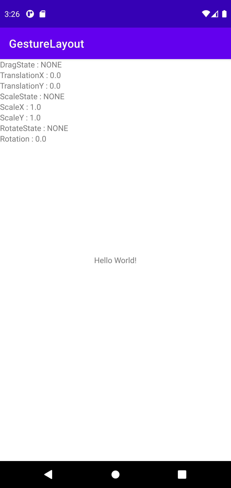
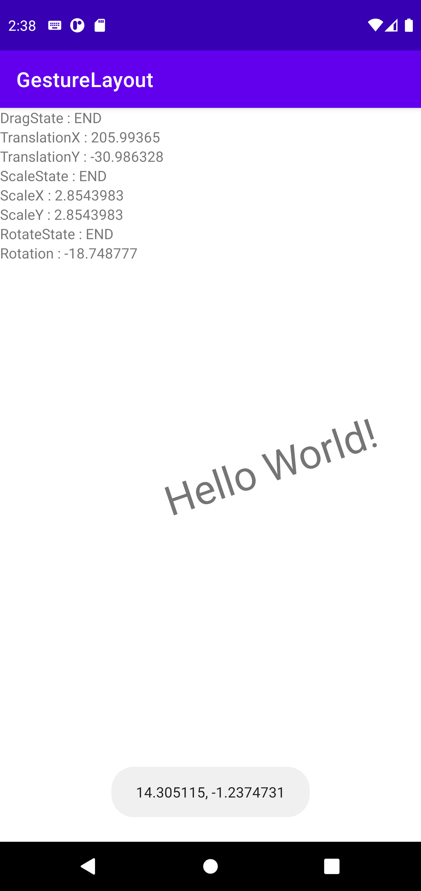
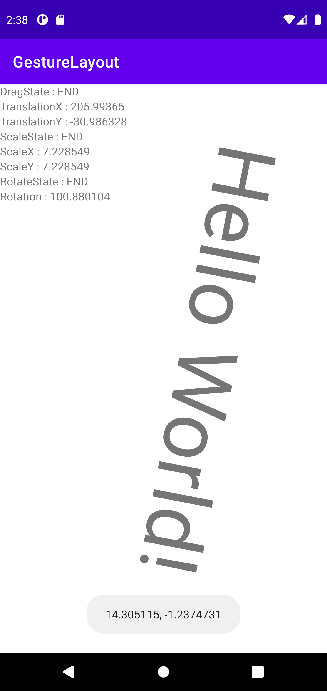
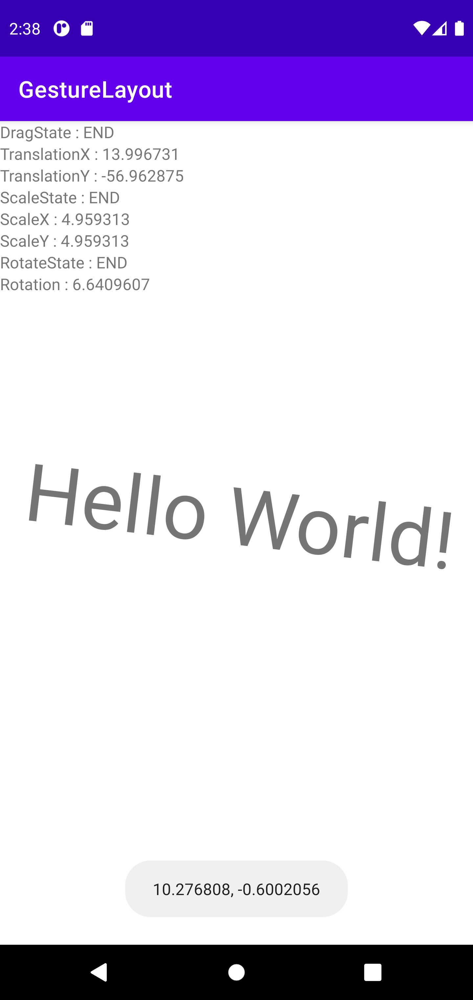

[](https://jitpack.io/#KangTaeJong98/GestureLayout)

# GestureLayout, GestureListener
***
### 🐘Dependency
#### Lastest Version : 1.0.2
[more (Maven, sbt, leiningen)](https://jitpack.io/#KangTaeJong98/Gesture)
```kotlin
allprojects {
    repositories {
        ...
        maven { url 'https://jitpack.io' }
    }
}
```
```kotlin
dependencies {
    implementation 'com.github.KangTaeJong98:Gesture:$version'
}
```
***
### 😊 Introduce

#### GestureLayout
* View를 추가할 경우 터치 영역을 넓히기 위한 Padding과 GestureListener를 자동으로 View에 설정합니다.
* When you add View, automatically set Paddings and GestureListener to expand the touch area in View.

#### GestureListener
* 인스타그램 스토리처럼 View를 드래그, 확대/축소, 회전을 할 수 있는 Listener입니다.
* It's a listener who can drag, zoom, and rotate View like an Instagram story.


***
### ⚡ Features

#### 설명 : https://rkdxowhd98.tistory.com/193
#### Explain : https://rkdxowhd98.tistory.com/193
***
#### GestureLayout
```kotlin
class GestureLayout @JvmOverloads constructor(context: Context, attrs: AttributeSet? = null, defStyleAttr: Int = 0, defStyleRes: Int = 0) : ConstraintLayout(context, attrs, defStyleAttr, defStyleRes) {
    var childViewPadding = 0
        set(value) {
            field = value
            for (view in children) {
                view.setPadding(value)
            }
        }

    var gestureListener: GestureListener? = GestureListener()
        set(value) {
            field = value
            for (view in children) {
                view.setOnTouchListener(value)
            }
        }

    init {
        context.theme.obtainStyledAttributes(attrs, R.styleable.GestureLayout, defStyleAttr, defStyleRes).apply {
            childViewPadding = getDimensionPixelSize(R.styleable.GestureLayout_childViewPadding, 0)
        }
    }

    override fun onViewAdded(child: View) {
        super.onViewAdded(child)
        child.setPadding(childViewPadding)
        child.setOnTouchListener(gestureListener)
    }
}
```

### GestureListener
```kotlin
open class GestureListener(
    var dragSensitive: Float = 10F,
    var zoomSensitive: Float = 0F,
    var rotateSensitive: Float = 0F
) : View.OnTouchListener {
    private val mode by lazy { Mode() }

    protected val onePoint by lazy { PointF() }
    protected val twoPoint by lazy { PointF() }
    protected val twoPointVector by lazy { Vector() }
    protected var twoPointDistance = 0F

    companion object {
        private fun twoPointDistance(event: MotionEvent): Float {
            val x = event.getX(0) - event.getX(1)
            val y = event.getY(0) - event.getY(1)

            return sqrt(x*x + y*y)
        }
    }

    override fun onTouch(view: View, event: MotionEvent): Boolean {
        when (event.actionMasked) {
            MotionEvent.ACTION_DOWN -> {
                actionDown(view, event)
            }
            MotionEvent.ACTION_POINTER_DOWN -> {
                actionPointerDown(view, event)
            }
            MotionEvent.ACTION_POINTER_UP -> {
                actionPointerUp(view, event)
            }
            MotionEvent.ACTION_CANCEL, MotionEvent.ACTION_UP -> {
                if (mode.only(Mode.TOUCH)) {
                    view.performClick()
                }

                actionCancel(view, event)
            }
            MotionEvent.ACTION_MOVE -> {
                when(event.pointerCount) {
                    1 -> {
                        calculateOnePointSensitive(view, event)
                        actionOnePoint(view, event)
                    }
                    2 -> {
                        calculateTwoPointSensitive(view, event)
                        actionTwoPoint(view, event)
                    }
                }
            }
        }

        return true
    }

    private fun actionSingleTap(view: View, event: MotionEvent) {
        if (mode.only(Mode.TOUCH)) {
            onSingleTap(view, event)
        }
    }
    private fun actionDrag(view: View, event: MotionEvent) {
        if (mode.contain(Mode.DRAG)) {
            onDrag(view, event, getDragX(event), getDragY(event))
        }
    }
    private fun actionZoom(view: View, event: MotionEvent) {
        if (mode.contain(Mode.ZOOM)) {
            onZoom(view, event, getZoom(event))
        }
    }
    private fun actionRotate(view: View, event: MotionEvent) {
        if (mode.contain(Mode.ROTATE)) {
            onRotate(view, event, getDegree(event))
        }
    }

    private fun actionDown(view: View, event: MotionEvent) {
        actionOnePointDown(view, event)
        actionTouchPointDown(view, event)
        actionDragPointDown(view, event)
    }

    protected fun actionOnePointDown(view: View, event: MotionEvent) {
        onePoint.set(event.x, event.y)
    }

    protected fun actionTouchPointDown(view: View, event: MotionEvent) {
        mode.add(Mode.TOUCH)
        onTouchStart(view, event)
    }
    private fun actionDragPointDown(view: View, event: MotionEvent) {

    }

    private fun actionPointerDown(view: View, event: MotionEvent) {
        actionTwoPointPointerDown(view, event)
        actionDragPointerDown(view, event)
        actionZoomPointerDown(view, event)
        actionRotatePointerDown(view, event)
    }

    private fun actionTwoPointPointerDown(view: View, event: MotionEvent) {
        val x = event.getX(0) + event.getX(1)
        val y = event.getY(0) + event.getY(1)
        twoPoint.set(x/2F, y/2F)
    }

    private fun actionDragPointerDown(view: View, event: MotionEvent) {
        if (mode.contain(Mode.DRAG)) {
            mode.minus(Mode.DRAG)
            onDragEnd(view, event)
        }
    }

    private fun actionZoomPointerDown(view: View, event: MotionEvent) {
        twoPointDistance = twoPointDistance(event)
    }

    private fun actionRotatePointerDown(view: View, event: MotionEvent) {
        twoPointVector.set(event)
    }

    private fun actionPointerUp(view: View, event: MotionEvent) {
        actionDragPointerUp(view, event)
        actionZoomPointerUp(view, event)
        actionRotatePointerUp(view, event)
    }

    private fun actionDragPointerUp(view: View, event: MotionEvent) {
        val index = if (event.actionIndex == 0) 1 else 0
        onePoint.set(event.getX(index), event.getY(index))
    }

    private fun actionZoomPointerUp(view: View, event: MotionEvent) {
        if (mode.contain(Mode.ZOOM)) {
            mode.minus(Mode.ZOOM)
            onZoomEnd(view, event)
        }
    }

    private fun actionRotatePointerUp(view: View, event: MotionEvent) {
        if (mode.contain(Mode.ROTATE)) {
            mode.minus(Mode.ROTATE)
            onRotateEnd(view, event)
        }
    }

    private fun actionCancel(view: View, event: MotionEvent) {
        actionSingleTap(view, event)
        actionTouchCancel(view, event)
        actionDragCancel(view, event)

        mode.clear()
    }

    private fun actionTouchCancel(view: View, event: MotionEvent) {
        if (mode.contain(Mode.TOUCH)) {
            mode.minus(Mode.TOUCH)
            onTouchEnd(view, event)
        }
    }

    private fun actionDragCancel(view: View, event: MotionEvent) {
        if (mode.contain(Mode.DRAG)) {
            mode.minus(Mode.DRAG)
            onDragEnd(view, event)
        }
    }

    private fun calculateOnePointSensitive(view: View, event: MotionEvent) {
        calculateDragMotion(view, event)
    }

    private fun calculateDragMotion(view: View, event: MotionEvent) {
        if (!mode.contain(Mode.DRAG) && isDragMotion(view, event)) {
            mode.add(Mode.DRAG)
            onDragStart(view, event)
        }
    }

    private fun calculateTwoPointSensitive(view: View, event: MotionEvent) {
        calculateZoomMotion(view, event)
        calculateRotateMotion(view, event)
    }

    private fun calculateZoomMotion(view: View, event: MotionEvent) {
        if (!mode.contain(Mode.ZOOM) && isZoomMotion(view, event)) {
            mode.add(Mode.ZOOM)
            onZoomStart(view, event)
        }
    }

    private fun calculateRotateMotion(view: View, event: MotionEvent) {
        if (!mode.contain(Mode.ROTATE) && isRotateMotion(view, event)) {
            mode.add(Mode.ROTATE)
            onRotateStart(view, event)
        }
    }

    private fun actionOnePoint(view: View, event: MotionEvent) {
        actionDrag(view, event)
    }

    private fun actionTwoPoint(view: View, event: MotionEvent) {
        actionZoom(view, event)
        actionRotate(view, event)
    }

    private fun getDragX(event: MotionEvent): Float {
        return event.x - onePoint.x
    }

    private fun getDragY(event: MotionEvent): Float {
        return event.y - onePoint.y
    }

    private fun getZoom(event: MotionEvent): Float {
        return twoPointDistance(event) / twoPointDistance
    }

    private fun getDegree(event: MotionEvent): Float {
        return Vector.getDegree(twoPointVector, Vector(event))
    }

    private fun isDragMotion(view: View, event: MotionEvent): Boolean {
        return (abs(getDragX(event)) >= dragSensitive ||
                abs(getDragY(event)) >= dragSensitive) &&
                event.pointerCount == 1
    }

    private fun isZoomMotion(view: View, event: MotionEvent): Boolean {
        return getZoom(event) >= zoomSensitive && event.pointerCount == 2
    }

    private fun isRotateMotion(view: View, event: MotionEvent): Boolean {
        return abs(getDegree(event)) >= rotateSensitive && event.pointerCount == 2
    }

    open fun onTouchStart(view: View, event: MotionEvent) {

    }
    open fun onTouchEnd(view: View, event: MotionEvent) {

    }
    open fun onSingleTap(view: View, event: MotionEvent) {

    }
    open fun onDrag(view: View, event: MotionEvent, movementX: Float, movementY: Float) {
        val array = arrayOf(movementX, movementY).toFloatArray()

        view.matrix.mapVectors(array)
        view.translationX += array.first()
        view.translationY += array.last()
    }
    open fun onDragStart(view: View, event: MotionEvent) {

    }
    open fun onDragEnd(view: View, event: MotionEvent) {

    }
    open fun onZoomStart(view: View, event: MotionEvent) {

    }
    open fun onZoom(view: View, event: MotionEvent, scale: Float) {
        view.scaleX *= scale
        view.scaleY *= scale
    }
    open fun onZoomEnd(view: View, event: MotionEvent) {

    }
    open fun onRotateStart(view: View, event: MotionEvent) {

    }
    open fun onRotate(view: View, event: MotionEvent, degree: Float) {
        view.rotation += degree
    }
    open fun onRotateEnd(view: View, event: MotionEvent) {

    }

    class Mode(private var bit: Int = NONE) {
        companion object {
            const val NONE = 0
            const val TOUCH = 0B1
            const val DRAG = 0B10
            const val ZOOM = 0B100
            const val ROTATE = 0B1000
        }

        private var log = NONE

        fun clear() {
            bit = NONE
            log = NONE
        }
        fun only(action: Int): Boolean {
            return bit == action
        }
        fun contain(action: Int): Boolean {
            return (bit and action) == action
        }
        fun add(action: Int) {
            bit = bit or action
            log = log or action
        }
        fun minus(action: Int) {
            bit = bit and action.inv()
        }
    }
    class Vector(x: Float = 0F, y: Float = 0F) : PointF(x, y) {
        companion object {
            fun getDegree(v1: Vector, v2: Vector): Float {
                return (180.0 / PI * (atan2(v2.y, v2.x) - atan2(v1.y, v1.x))).toFloat()
            }
        }

        constructor(event: MotionEvent) : this() {
            set(event)
        }

        fun set(event: MotionEvent) {
            x = event.getX(1) - event.getX(0)
            y = event.getY(1) - event.getY(0)
            reduction()
        }

        private fun reduction() {
            sqrt(x*x + y*y).also {
                x /= it
                y /= it
            }
        }
    }
}
```
